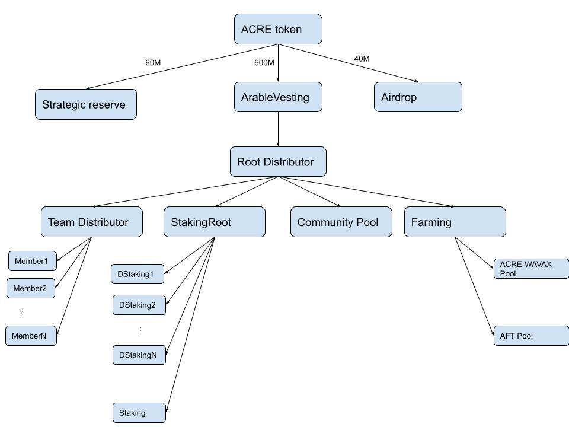

# arablecontracts

## Contracts Architecture

## Fuji Addresses

- Treasury Address: 0x2e84741f27e2993D637f3a537191101ccBF67050

- USDT: 0x21f40BBf1e9910b1479F473f39B9697095F9Ed97[https://testnet.snowtrace.io/address/0x21f40BBf1e9910b1479F473f39B9697095F9Ed97]
- ACRE: 0x23542139268078d36b75fAB7b3e3DEb50f038b3D[https://testnet.snowtrace.io/address/0x23542139268078d36b75fAB7b3e3DEb50f038b3D]
- OTC: 0x363f67e27224779c77633C5296ca22dA2b614693[https://testnet.snowtrace.io/address/0x363f67e27224779c77633C5296ca22dA2b614693]
- RootDistributor: 0xD0a96D7E8765EB9fb3702246AbA7F5e5e42B4a0B[https://testnet.snowtrace.io/address/0xD0a96D7E8765EB9fb3702246AbA7F5e5e42B4a0B]
- TeamDistributor: 0x6b16Ea70e82DefDe1bE123224C124cdBC9A065Cf[https://testnet.snowtrace.io/address/0x6b16Ea70e82DefDe1bE123224C124cdBC9A065Cf]
- ArableVesting: 0x567b32C78D6275e3575Daa676BbDC3720123B0c8[https://testnet.snowtrace.io/address/0x567b32C78D6275e3575Daa676BbDC3720123B0c8]
- TokenLocker: 0xFbE3F8902024AA7eb0dEf5C439D81278839a9B1C[https://testnet.snowtrace.io/address/0xFbE3F8902024AA7eb0dEf5C439D81278839a9B1C]
- StakingRoot: 0x78f1442f97dbacC79F1d4C74d3097Dc460d93672[https://testnet.snowtrace.io/address/0x78f1442f97dbacC79F1d4C74d3097Dc460d93672]
- Staking: 0x96C726cC2Fe6121f8f69ea31594B33f14Ab00d11[https://testnet.snowtrace.io/address/0x96C726cC2Fe6121f8f69ea31594B33f14Ab00d11]
- DStakingOverview: 0xf679f0500bFeb51B2345233b27a177e4018e3B1A[https://testnet.snowtrace.io/address/0xf679f0500bFeb51B2345233b27a177e4018e3B1A]
- FarmingFactory: 0x25686E5F0f5CD1c0295212d8b6bc427f1f00BE2b[https://testnet.snowtrace.io/address/0x25686E5F0f5CD1c0295212d8b6bc427f1f00BE2b]
- Farming: 0x82bd5ba2ad6aDF7aa1bCb78527d2ab00F6956094[https://testnet.snowtrace.io/address/0x82bd5ba2ad6aDF7aa1bCb78527d2ab00F6956094]
- AirDrop: 0xB041EE4083cEFcbC61feC0085d38a06Bf3642850[https://testnet.snowtrace.io/address/0xB041EE4083cEFcbC61feC0085d38a06Bf3642850]

- ArableFaucet: 0xcdf5e1EC6ACDC40b8f9db95c1BA465A5dd8cE1A0[https://testnet.snowtrace.io/address/0xcdf5e1EC6ACDC40b8f9db95c1BA465A5dd8cE1A0]
- Pangolin Factory: 0xE4A575550C2b460d2307b82dCd7aFe84AD1484dd[https://testnet.snowtrace.io/address/0xE4A575550C2b460d2307b82dCd7aFe84AD1484dd]
- Pangolin Router: 0x2D99ABD9008Dc933ff5c0CD271B88309593aB921[https://testnet.snowtrace.io/address/0x2D99ABD9008Dc933ff5c0CD271B88309593aB921]
- WAVAX-ACRE on Pangolin: 0x1ce13340b2677357f4944b58c675abb1d6d671e2[https://testnet.snowtrace.io/address/0x1ce13340b2677357f4944b58c675abb1d6d671e2]
- AFT: [0x7E309EA562892fCB691B4460D350144020379647](https://testnet.snowtrace.io/address/0x7E309EA562892fCB691B4460D350144020379647)

- Multicall: [0xdFC90A97A98Fbdd33fFCa77539f81B905186eF3a](https://testnet.snowtrace.io/address/0xdFC90A97A98Fbdd33fFCa77539f81B905186eF3a)
